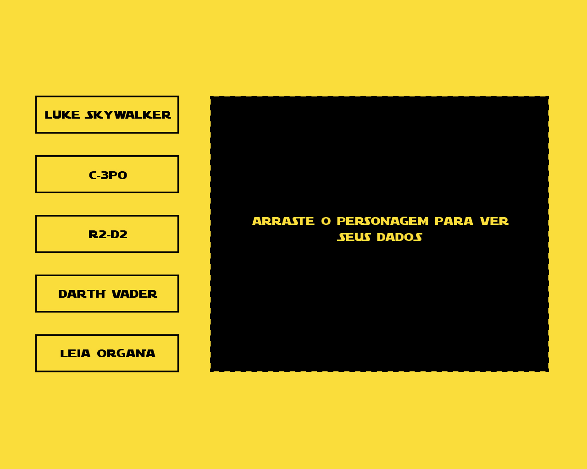
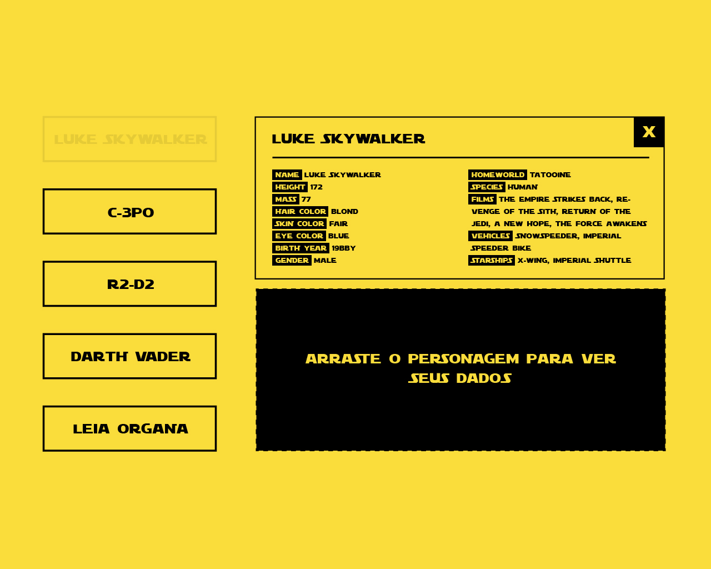

# <> Desafio front-end - QuestManager </>

- [Sobre](#sobre)
    - [Iniciando](#iniciando)
    - [Quais habilidades o desafio envolve?](#quais-habilidades-o-desafio-envolve)
    - [Seria ótimo se ...](#seria-otimo-se)
- [Mãos à obra!](#maos-a-obra)
    - [Primeira página](#primeira-pagina)
    - [Segunda página](#segunda-pagina)
    - [Terceira página](#terceira-pagina)
        - [Etapa 1](#etapa-1)
        - [Etapa 2](#etapa-2)
        - [Etapa 3](#etapa-3)
        - [Etapa 4](#etapa-4)
- [Enviando seu código](#enviando-seu-codigo)
- [Em caso de problemas ou dúvidas](#em-caso-de-problemas-ou-duvidas)

## Sobre
A prova consiste em exibir dinamicamente os dados de um episódio de Star Wars, incluindo o título, abertura e uma lista dos personagens que aparecem nesse filme com seus respectivos dados.

Todos os dados serão consumidos do [**SWAPI - The Star Wars API**](https://swapi.co/).

### Iniciando
Leia a documentação do [**SWAPI - The Star Wars API**](https://swapi.co/) para saber como fazer suas requisições.

Faça um fork e trabalhe no seu próprio repositório.

Caso ainda não tenha lido os detalhes da vaga, veja aqui no [**LinkedIn**]().

### Quais habilidades o desafio envolve?
Iremos analisar a sua capacidade de manipulação dinâmica da DOM através de um framework JavaScript, bem como a capacidade de tratamento de dados dinâmicos recebidos através de um serviço independente e a sua habilidade para estilizar o site.

O conhecimentos que você deve utilizar:
* Seu framework JavaScript de preferência
* HTML5 / CSS / JS
* Consumo a API (REST ou GraphQL)
* Responsividade
* Controle de versionamento

### Seria ótimo se ...
* utilizar GraphQL
    * Fazer consultas recebendo apenas os dados pertinentes
* utilizar a semântica do HTML5
* realizar requisições assíncronas com boa experiência do usuário
    * demonstrar ao usuário que as informações ainda estão sendo carregadas
    * tratamento de erro para possíveis falhas nas requisições
* ter um código limpo
* fazer uso do GitFlow

## Mãos à obra!

### Primeira página

#### O que fazer?
Aqui está o único conteúdo textual que será fixo. As palavras `Star` e `Wars` deverão ser fixas mas o subtítulo não. Para receber o subtítulo você precisará consultar o SWAPI.

Há duas formas de identificar qual será o filme:
* Inserir manualmente o ID no seu código
* Criar uma área na primeira página na qual o usuário irá escolher um dos 7 filmes fornecidos pelo SWAPI
    * Ao escolher essa forma, a página não deverá ser recarregada quando o usuário escolher outro filme.

Todas as outras páginas devem ter apenas os dados respectivos ao filme escolhido na primeira página.

### Segunda página

#### O que fazer?
A abertura do filme selecionado na primeira página. 

Deverá respeitar as quebras de linhas fornecidas pela API.

### Terceira página
Aqui as coisas ficam mais interessantes...

#### Etapa 1

##### O que fazer?

1. Uma lista com os personagens que aparecem no filme escolhido na primeira página. No exemplo colocamos apenas cinco mas você deverá apresentar todos.
2. Um campo para receber através de **drag and drop** um personagem.
3. A requisição deve ser sob demanda, ou seja, você só irá obter no primeiro momento o nome e o identificador do personagem para alimentar a lista na esquerda e depois fazer outra consulta a fim de obter os dados da **Etapa 2**.

#### Etapa 2

##### O que fazer?
1. Quando o usuário soltar o personagem que deseja saber os detalhes no destino, você fará uma nova requisição para receber os dados dele. Você pode dispor os dados da forma que preferir, seguindo ou não o exemplo.
2. A visualização dos dados de um personagem deverá desabilitá-lo na lista até que seja excluído.
2. No desktop o usuário poderá visualizar simultâneamente mais de um personagem por vez. Você pode definir a quantidade ideal.
3. Até atingir o limite o campo de drop deverá se ajustar com os os personagens detalhados.

#### Etapa 3

##### O que fazer?
1. Caso o usuário atualize a página a lista de personagens detalhados deverá permanecer intacta.
2. Caso o usuário troque o filme na primeira página a lista de personagens detalhados deve ser "zerada", mesmo que existam personagens em comum entre os filmes.

#### Etapa 4

##### O que fazer?
Como já foi informado, o site deve ser responsivo. Caso o usuário esteja acessando o site através de um celular ou tenha a resolução muito baixa não deverá ser possível visualizar os dados de mais de um personagem por vez.

## Enviando seu código
Faça um PR e não se esqueça de explicar como rodar seu código.

## Em caso de problemas ou dúvidas
Abra uma Issue com todos os detalhes.